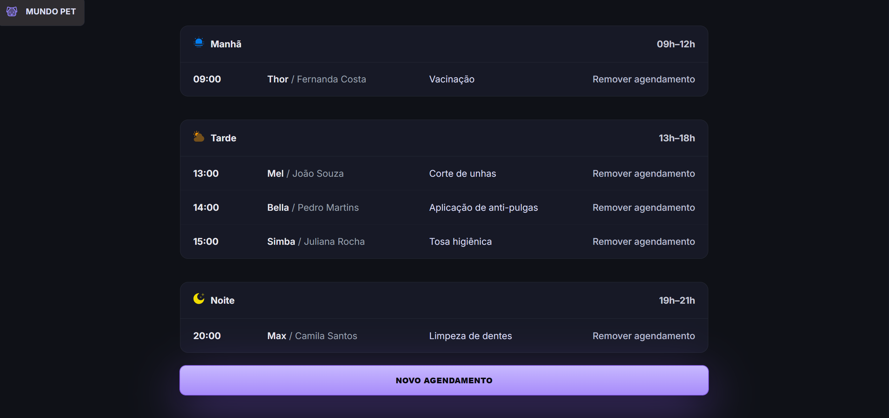

# 🐾 Mundo Pet — Agenda

A simple and elegant **dark-themed UI** for **Pet Shop scheduling**. This is a **static project** (HTML + CSS + JavaScript) focused on **consistent design**, **accessibility**, and **modular code organization**.



---

## ✨ Overview

**Mundo Pet — Agenda** was built to demonstrate good UI/UX practices in front-end projects without external dependencies or build steps. It includes custom, accessible, and visually consistent components using **CSS variables (design tokens)** and **vanilla JavaScript**.

---

## 🚀 Features

* ✅ **Dark theme** powered by CSS variables (design tokens)
* ✅ **Accessible modal**

  * Close with `Esc`
  * Click outside to close
  * Keyboard *focus trap*
* ✅ **Styled native date picker**

  * Right-aligned arrow icon
  * Clickable indicator
* ✅ **Custom select (picker)**

  * Popup list
  * ARIA attributes for accessibility
* ✅ **Themed scrollbars**

  * Compatible with Firefox and WebKit
* ✅ **Consistent form fields**

  * Standardized sizing
  * Precise icon alignment

---

## 🛠️ Technologies Used

| Technology   | Purpose                                          |
| ------------ | ------------------------------------------------ |
| HTML5        | Semantic markup and structure                    |
| CSS3         | Styling, design tokens, and modular architecture |
| JavaScript   | Modal state management and picker behavior       |
| Google Fonts | *Inter* typeface (optional)                      |

---

## 📂 Project Structure

```text
project-root/
├── index.html
└── src/
    ├── assets/
    │   └── icon/
    │       ├── arrow.svg
    │       └── ... other SVG icons
    ├── script/
    │   └── script.js
    └── style/
        ├── index.css          # Imports all modules below
        ├── core/
        │   ├── base.css       # Reset and global styles
        │   ├── scrollbars.css # Custom scrollbars
        │   └── tokens.css     # Design tokens (colors, spacing, etc.)
        ├── layout/
        │   ├── brand.css      # Visual identity
        │   └── content.css    # Layout structure
        └── components/
            ├── blocks.css
            ├── buttons.css
            ├── date-picker.css
            ├── form.css
            ├── modal.css
            └── picker.css
```

---

## ♿ Accessibility

This project was developed with accessibility in mind:

* Full keyboard navigation
* Proper use of **ARIA attributes**
* Visible focus states
* Predictable behavior for interactive components

---

## 🤝 Contributing

Contributions, issues, and feature requests are welcome!

Feel free to check the repository **Issues** tab to report bugs or suggest improvements.

### How to Contribute

1. Fork this repository
2. Create a new branch (`git checkout -b feature/YourFeature`)
3. Commit your changes (`git commit -m 'Add new feature'`)
4. Push to the branch (`git push origin feature/YourFeature`)
5. Open a Pull Request

---

## ⭐ Support the Project

If you like this project, consider giving it a **⭐ star on GitHub** — it really helps! 🙌

---

## 📄 License

This project is free to use for educational and portfolio purposes.
